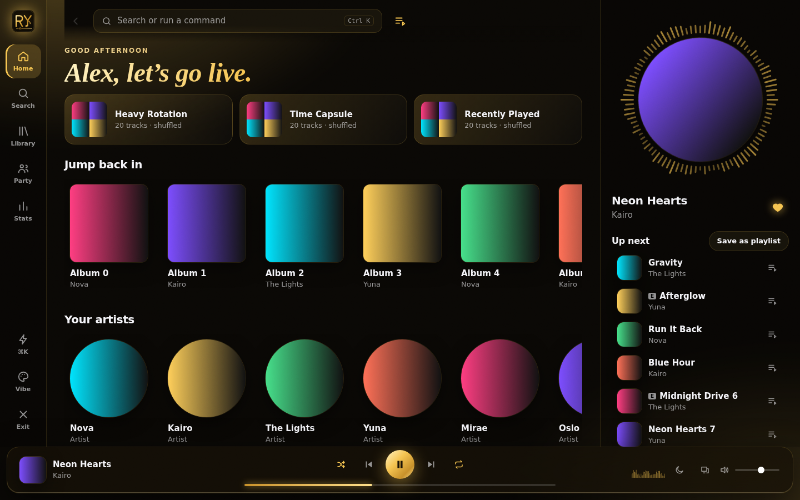
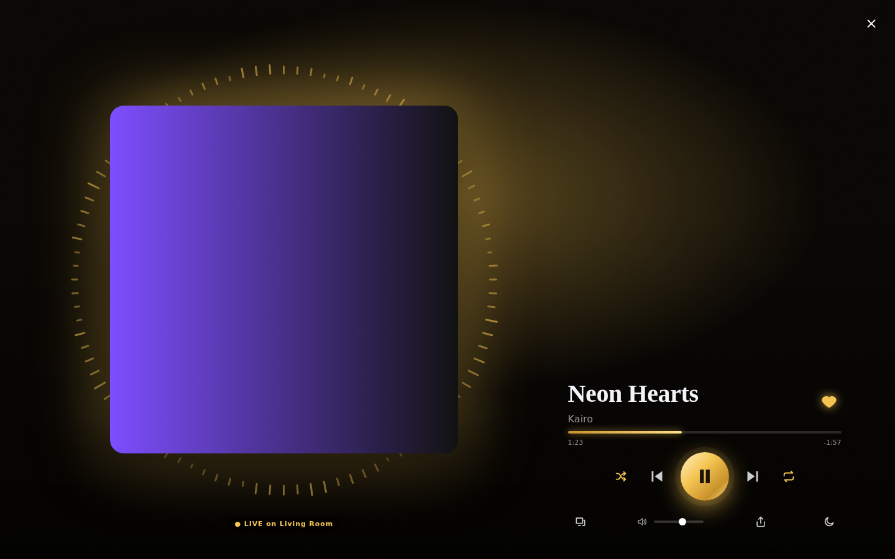
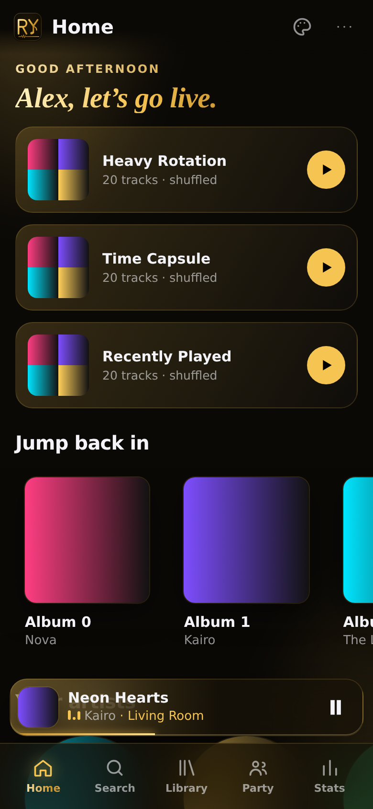
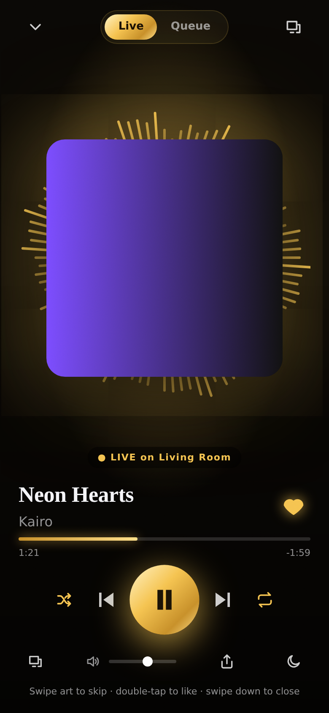
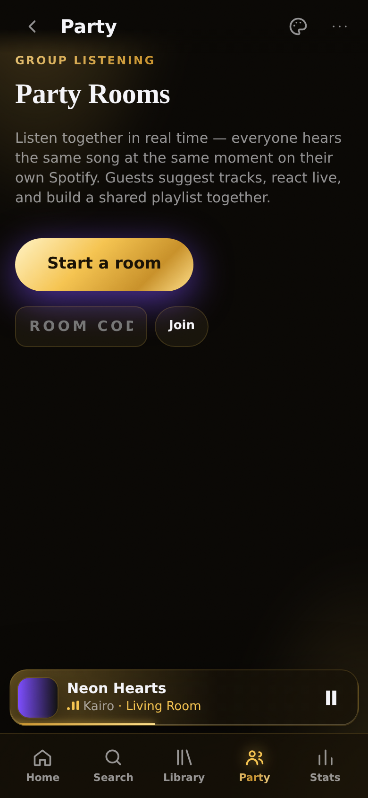
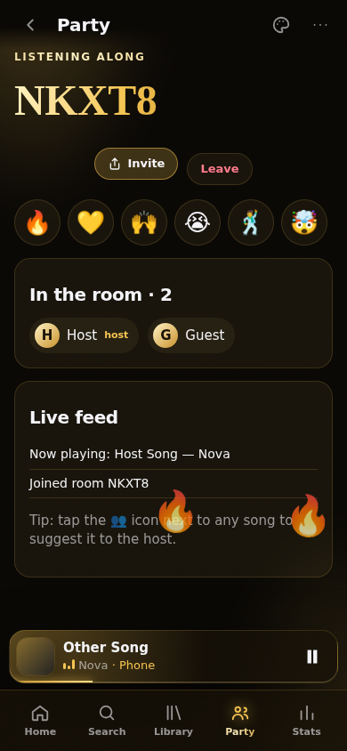
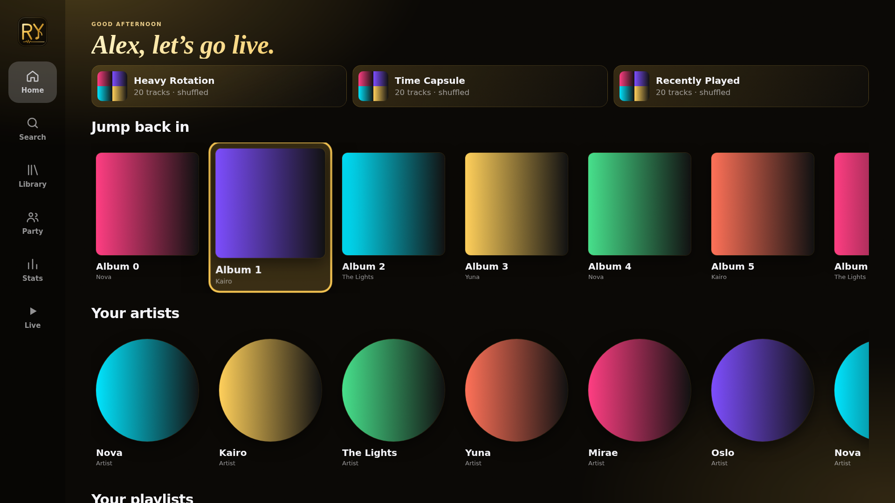

# RY Music — Ultra Premium Live Player

A gold, premium Spotify client for **web, Android phones, Android TV and iOS** from one codebase
(React + TypeScript + Vite, packaged with Capacitor). It is built on Spotify's **official** Web API and
Web Playback SDK. It has no ad blocking, no audio ripping, and is safe for your account.

<p align="center"></p>

## Three layouts, one app

| Device | Layout |
| --- | --- |
| **Desktop / web** | *Studio*: an icon rail, a scrolling content area, an always-on **Live Deck** (spinning vinyl + visualizer + queue), a floating glass dock, ⌘/Ctrl-K command palette, full keyboard control, and a full-screen **Stage** (press `F`). |
| **Mobile** | Thumb-first: a big serif header, swipeable shelves, a floating glass mini player (swipe it to skip), a pill tab bar, and a full-screen **Live player** with gestures. |
| **Android TV** | 10-foot UI: a focus rail, oversized tiles, spatial D-pad navigation, media-remote keys, and an ambient Live screensaver after 20 s idle. |

The layout is picked automatically. You can force one with `?layout=desktop|mobile|tv`.

## Features

- **Live player vibe**: album-art backdrop that blurs and slowly rotates, an accent colour taken from the cover, a reactive ring visualizer, a breathing play button, a "LIVE on <device>" pill, and marquee titles.
- **Motion mode 🎬**: shows the track's official music video, muted, through YouTube's official embedded player and kept in sync with the Spotify audio. Needs a YouTube API key.
- **Party Rooms 👥**: real-time group listening. The host's playback is mirrored to every guest's own Spotify. Guests can suggest songs (auto-queued or approved by the host), send live emoji reactions, and add to a **collaborative shared playlist**. Hosting passes to the next person automatically. Invite links work as `/?party=CODE`.
- **Sharing**: uses the phone's native share sheet, or copies the link on desktop.
- **Background play and lock screen**: Media Session controls (lock screen, notification shade, headphones, watch).
- **Spotify Connect**: control and switch between any speaker, TV or phone.
- **Gestures**: swipe the art to skip, double-tap to like, swipe down to close, and swipe the mini player to skip.
- **Mixes**: Heavy Rotation, Time Capsule and Recently Played, each shuffled in one tap.
- **Sound DNA stats**: top tracks and artists for 4 weeks, 6 months or all time, a listening clock, peak hour, genre breakdown, and saving your top tracks as a playlist.
- **Playlist tools**: filter, sort by title/artist/length, and remove duplicates in one tap.
- **Queue**: save the current queue as a playlist.
- **Sleep timer**: 5 to 90 minutes.
- **Themes**: **Gold** (default), Dynamic (follows the album art), AMOLED black, Neon and Sunset.
- **Installable PWA** with a cached app shell.

## Quick start (web)

```bash
npm install
cp .env.example .env        # fill in VITE_SPOTIFY_CLIENT_ID
npm run dev                 # http://127.0.0.1:5173
npm run party               # optional: Party Rooms server on :8787
```

1. Create an app at <https://developer.spotify.com/dashboard>.
2. Add the Redirect URIs `http://127.0.0.1:5173/callback` (web) and `rymusic://callback` (native).
3. Tick **Web API** and **Web Playback SDK**, then copy the Client ID into `.env`.
4. While your Spotify app is in *Development mode*, add each listener's email under **User Management**.

Playback inside the browser needs **Spotify Premium**. That's Spotify's rule for third-party players.

### Optional keys

| Variable | Enables |
| --- | --- |
| `VITE_YOUTUBE_API_KEY` | Motion mode. Create a YouTube Data API v3 key in Google Cloud Console. |
| `VITE_PARTY_URL` | Party Rooms server (`ws://…` locally, `wss://…` in production). |

## Platform guides

- [Android phone](docs/ANDROID.md)
- [Android TV](docs/ANDROID_TV.md)
- [iOS / iPadOS](docs/IOS.md)
- [Party Rooms server and deployment](docs/PARTY.md)

## How playback works

| Platform | Audio |
| --- | --- |
| Desktop browsers, Android TV browser | The in-app **Web Playback SDK** device "RY Music". |
| Phones (Android / iOS) | Spotify doesn't allow its SDK in mobile browsers or WebViews, so RY Music acts as a **Connect remote** for the Spotify app on the phone (or any speaker). Audio keeps playing in the background, and the lock screen and Bluetooth controls work. |

## Project layout

```
src/
  lib/          auth (PKCE), api, store, engine (SDK, polling, media session, sleep timer),
                party, youtube, share, color, layout detection
  components/   NowPlaying (Live stage), Motion, Visualizer, Queue, CommandPalette, shared UI
  views/        Home, Search, Library, Playlist, Artist, Stats, Party
  shells/       DesktopShell, MobileShell, TvShell
server/party.mjs  WebSocket relay for Party Rooms
android/  ios/    Capacitor native projects
```

## Legal

RY Music is an independent project. It is not affiliated with or endorsed by Spotify or YouTube.
"Spotify" is a trademark of Spotify AB. RY Music uses its own logo and follows the
[Spotify Developer Terms](https://developer.spotify.com/terms) and YouTube API Services Terms. Videos play muted
through YouTube's official embed, and audio is never downloaded.

## Screenshots (rendered with demo data)

| Desktop Studio | Desktop Stage |
| --- | --- |
|  |  |

| Mobile Home | Mobile Live | Mobile Stats | Party Room |
| --- | --- | --- | --- |
|  |  |  |  |


